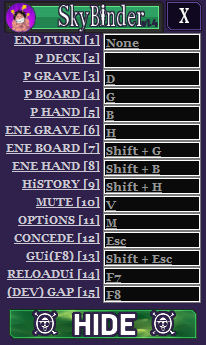

# SkyBinder
Currently its just an `AHK` that can openendly be given bind keys to perform actions.

__Requires:__  [AutoHotKey](https://www.autohotkey.com/download/)

It will only activate onto anything with "Skyweaver" in itsname, and it has to be fullscreen in-game ui 0.69. Nice.

Hotkeys are saved & stored in an `.ini` file where this `.ahk` file resides.

Once running you can either press **"F8"**, or select the 'Keybinds' option in your Tray to setup your binds.
___

###### Your options are the functions listed below, or feel free to have it do anything you want it to do as your copy is your copy.


### Functions
```
Grabscreenregion() - When bound to a hotkey it will save your cursor position when pressed to your clipboard. In the syntax this code likes.
GAP(RatioX, RatioY) - For more dynamically found pixels, uses the selected's window maxW/H. GetAbsolutePixels
RNGsleep(MinMS, MaxMS, Click) - Whats not more fun than a little sleepytime RNG?
doAction(xRatio, yRatio, Click, ReturnToOrigialPosition) - Where (,,true,true) Moves to 0.x,0.y, clicks, then returns cursor to OG position.
```
### Customizing the script
* The Quantity of hotkeys are tied to the ActioName Array, so add/remove from that to add/remove hotkeys too.
* Easily title next to the hotkeys as ActionName and its Hotkeyed Actions are tied 1:1.
* Assigning actions to the hotkeys are found at the very end of the script. Starting at `Action1:`
____
#### If theres any problems with the alignment of the binds
GrabScreenregion, or '(DEV) GAP'. Once the bind for this function is used, it will save and simplify the proccess by adding a string to your clipboard of the data from where your cursor was relative to the Skyweaver Window. `doAction(0.xx,0.yy)`
###### edit at the bottom of the ahk in 'action#' your new values. Reload- profit.

### Known issues :
* Can bind Mousebutton4 (XButton1), Mousewheel press (MButton), and other special keys. Just not through the GUI. Only by Editing the `.ini` file. see [AHK SEND](https://www.autohotkey.com/docs/commands/Send.htm)

* HotKey text doesnt display right information. `ini`. I think to style them it caused the hotkey display to shift by one, so 'wip'... They work fine, its just jank, the ini file #s coorelate it just is the display.

* Me and my style choices lol

# Next to be added
- [x] Be an idiot and not use the 'Releases' feature
- [x] Auto-forefit & requeue
- [ ] Emotes 	:lying_face:
- [ ] Smorc
